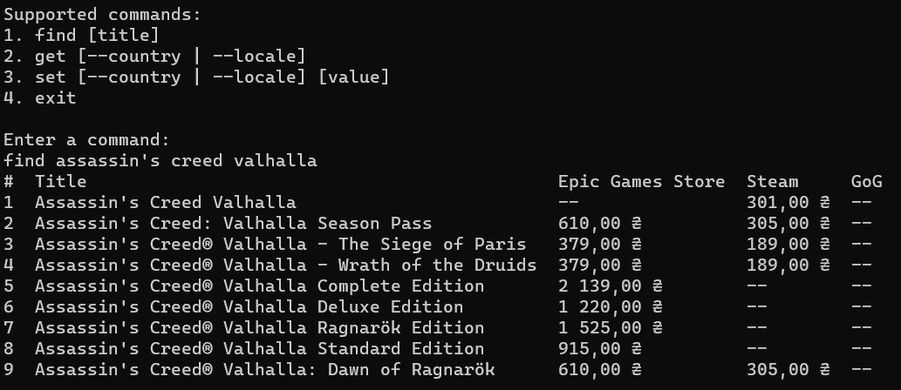
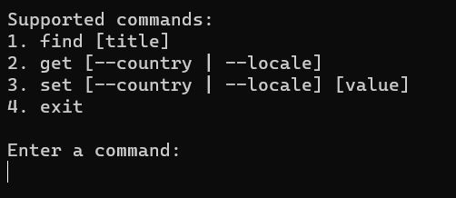
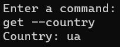
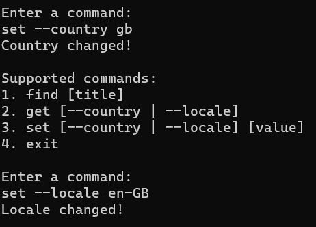

## Game stores web scraper

A simple CLI web scraper for fetching latest prices of games from different online game stores (Epic Games Store, Steam and GOG at the moment)

Example of usage:

  
### Installation

The prebuilt executable can be downloaded from *Releases* section here on GitHub.

**Alternatively** you can build it manually:
- You need to have Go installed on your machine (visit official Go installation [guide](https://go.dev/doc/install)).
- Clone this repository and navigate to `src/`.
- Run `go build -o [your folder here]`. This will create executable in the specified folder.
***The application will generate some files, so if you don't want them to be scattered around, make a dedicated folder for the app!***
- Launch the built executable (`web-scraper.exe`) and enjoy!

### User manual
On the first launch of the application you will see the following message: `userProfile.bin not found, loading fallback values`. This means that in the folder where the application is located a `userProfile.bin` file was created. This file contains country code and locale of the user. When the file is created on the first launch `ua` and `uk` will be chosen as default (Glory to Ukraine!).

Once open the application will display all available commands and prompt the user to enter a command:

1. `find [title]` where title must be a string (like `far cry 6`, **without the double quotes**).
2. `get [--country | --locale]` allows to query currently selected country code or locale:

3. `set [--country | --locale] [value]` allows to change the country code or locale:

Country code **must** be valid (refer to this [list](https://countrycode.org/), where first two letters of the third column are valid country codes).
Locale **must** be valid (refer to this [list](https://www.science.co.il/language/Locale-codes.php), where the third column contains valid locales).
Otherwise, the country code and/or locale will be left unchanged.

4. `exit` simply closes the application.

### Development progress
Currently the application has very limited functionality, but I have plans for developing it much further!

Planned features include:
- **Wishlist** - user can select specific games that they are interested in, the application will start tracking these games on stores and notify user about discounts
- **Game releases** - the app periodically gathers information from stores and notifies user about new releases
- **New stores** - the app will support more online game stores
- **GUI client** - GUI will provide better user experience (although CLI edition will still be available)

Check out my [Trello board](https://trello.com/b/0W9bt4xw/game-stores-scraper) to see the development progress.

If you found a bug or have an idea for new feature, then feel free to create an issue here on GitHub.